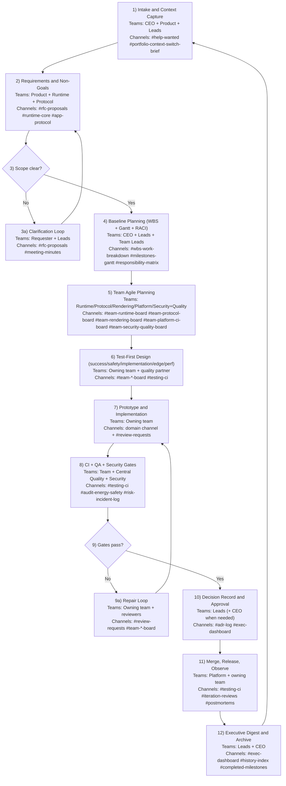

# Luvatrix Discord Operating System v4

## Summary
This document defines why the Discord server exists, how it supports company operations, and how teams execute world-class engineering with hybrid Gantt + Agile delivery, robust quality gates, and AI/human collaboration.

## Why This Server Exists
1. **Fast onboarding**: any human or AI should become useful quickly using the same non-private source-of-truth artifacts.
2. **Decision traceability**: major decisions and alternatives must be easy to audit months later.
3. **Execution clarity**: CEO + leads run milestone planning in one place while teams execute in their own Agile boards.
4. **Quality robustness**: safety, correctness, and edge-case rigor are required before merge and release.
5. **Context switching support**: executive channels provide concise, high-signal project state recovery.

## Operating Contracts
1. Artifact IDs: `CHARTER`, `WORKPLAN`, `GANTT`, `WBS`, `RACI`, `ADR-INDEX`, `RISK-REGISTER`, `EXEC-DIGEST`.
2. Planning linkage IDs: milestones `M-###`, epics `E-###`, tasks `T-###`; every `E-###` maps to one `M-###`.
3. Decision interface: major changes require `RFC -> ADR -> PR/Test evidence`.
4. Onboarding outputs: `state summary`, `assumptions`, `first-task proposal`, `evidence links`.
5. Done gate: no feature is done unless test strategy and evidence are posted (success/safety/implementation/edge/perf-regression).

## Discord Architecture and Why Each Area Exists
1. **`00_START_HERE`**: makes onboarding deterministic for humans and AI.
- `#welcome`: mission, norms, role model.
- `#server-map`: where each class of work belongs.
- `#onboarding-checklist`: mandatory first steps and completion checks.
- `#project-charter-public`: anchors project intent and scope.
- `#workplan-public`: anchors current execution strategy.
- `#reports-index-public`: one index for non-private progress/final reports.
- `#agent-onboarding`: machine-readable onboarding protocol.
- `#ai-ethics-safety-charter`: shared AI/human safety, governance, and escalation rules.
- `#glossary-protocols`: consistent vocabulary for faster collaboration.

2. **`01_PLANNING_SYSTEM`**: connects strategy to execution.
- `#milestones-gantt`: high-level timeline, dependencies, critical path.
- `#wbs-work-breakdown`: decomposes milestones into work packages.
- `#responsibility-matrix`: explicit ownership and accountability.
- `#cross-team-dependencies`: surfaces blocking dependencies early.
- `#planning-change-log`: preserves why schedule/scope changed.

3. **`02_TEAM_AGILE_BOARDS`**: team-specific execution engine.
- `#team-runtime-board`
- `#team-protocol-board`
- `#team-rendering-board`
- `#team-platform-ci-board`
- `#team-security-quality-board`
- `#agile-ceremonies`

4. **`03_ENGINEERING_STREAMS`**: technical discussion by domain.
- `#runtime-core`
- `#app-protocol`
- `#rendering-vulkan-macos`
- `#hdi-sensors`
- `#audit-energy-safety`
- `#testing-ci`

5. **`04_DECISIONS_AND_RECORDS`**: institutional memory and governance.
- `#rfc-proposals`
- `#adr-log`
- `#meeting-minutes`
- `#iteration-reviews`
- `#risk-incident-log`
- `#postmortems`

6. **`05_EXECUTIVE` (restricted)**: high-signal leadership control plane.
- `#exec-dashboard`
- `#portfolio-context-switch-brief`
- `#resource-budget`
- `#external-stakeholder-comms`

7. **`06_COLLABORATION`**: coordination and throughput.
- `#help-wanted`
- `#review-requests`
- `#pairing-room`
- `#wins-demos`

8. **`07_ARCHIVE`**: prevents knowledge loss.
- `#history-index`
- `#closed-rfcs`
- `#completed-milestones`
- `#retired-context`

## Mandatory Non-Private Onboarding Artifacts
1. `CHARTER`: defines mission, success criteria, scope boundaries, stakeholders, and team norms.
2. `WORKPLAN`: defines near-term approach, deliverables, assumptions, resources, and constraints.
3. `GANTT`: defines milestone timeline, dependencies, critical path, dates, and confidence.
4. `WBS`: defines deliverable decomposition into concrete work packages.
5. `RACI`: defines responsibility/accountability/consulted/informed by task and decision class.
6. `ADR-INDEX`: defines decision history, alternatives considered, and rationale.
7. `RISK-REGISTER`: defines active risks, impact/likelihood, mitigations, owners, and review cadence.
8. `EXEC-DIGEST`: defines weekly CEO-ready state snapshot and next-week priorities.

## AI Onboarding and Ethics Charter
1. AI must read all onboarding artifacts before proposing tasks.
2. AI must publish a state summary with evidence links.
3. AI must propose work tied to `M-###` and `E-###`.
4. AI and humans co-author `#ai-ethics-safety-charter` with versioned revisions.
5. Charter must include:
- user safety and welfare principles
- privacy and secret-handling requirements
- provenance/citation requirements
- fairness/harm review expectations
- escalation boundaries and human approval gates
- incident response and corrective action

## Hybrid Gantt + Agile Model
1. CEO + leads own high-level Gantt milestones and sequencing.
2. Each engineering team co-designs its Agile board with CEO and leads.
3. Every board item references milestone ID.
4. Weekly leadership review updates milestone health from board evidence.
5. Schedule baseline changes require an entry in `#planning-change-log` with rationale.

## Quality Model (Embedded + Central)
1. Each team owns feature-level test design and automation in their domain.
2. A central quality function (initially lean) owns global standards, release gates, and cross-team/system quality.
3. Why both:
- embedded ownership keeps quality close to implementation;
- central governance keeps standards consistent and catches cross-domain regressions.
4. Discord support:
- team-level evidence in `#team-*-board` and domain channels;
- gate outcomes and regressions in `#testing-ci`;
- risks and incidents in `#risk-incident-log` and `#postmortems`.

## Required Feature Workflow (Robustness Standard)
1. Design success criteria.
2. Design safety tests.
3. Design implementation tests.
4. Design edge-case tests.
5. Build prototype.
6. Add performance and regression budget checks before merge.
7. Post evidence links in PR and relevant Discord channels.

## Bot Strategy (Initial)
Use one LLM backend with multiple scoped identities plus non-LLM automation.

### Non-LLM Bot Recommendations (1-4)
1. `Housekeeping bot`: **Carl-bot**
- Why: mature moderation, logging, reaction roles, and server hygiene controls.
- Use for: welcome flow, role assignment, moderation baselines, channel guardrails.
- Link: [https://carl.gg/onboarding/1404527593725759618](https://carl.gg/onboarding/1404527593725759618)

2. `Workflow bot`: **sesh** (with optional **n8n** later)
- Why: reliable scheduling for standups/reviews across time zones.
- Use for: recurring team ceremonies and leadership cadence reminders.
- Links:
  [https://sesh.fyi/](https://sesh.fyi/)
  [https://docs.n8n.io/integrations/builtin/app-nodes/n8n-nodes-base.discord/](https://docs.n8n.io/integrations/builtin/app-nodes/n8n-nodes-base.discord/)

3. `Release bot`: **MyRepoBot**
- Why: quick GitHub-to-Discord signal routing for PR/release coordination.
- Use for: release channel notifications, merge/review nudges, release readiness visibility.
- Link: [https://github.com/marketplace/myrepobot-for-discord](https://github.com/marketplace/myrepobot-for-discord)

4. `Risk/Incident bot`: **Ticket Tool**
- Why: structured incident intake, ownership, and resolution tracking.
- Use for: incident channels/tickets, on-call escalation workflows, postmortem intake.
- Link: [https://docs.tickettool.xyz/](https://docs.tickettool.xyz/)

### AI Engineer Bot Model (Single LLM, Multiple Discord Identities)
1. Keep one shared LLM API backend for cost control.
2. Expose multiple role-specific Discord bot identities with isolated policies:
- `AI-Architect`
- `AI-Implementer`
- `AI-Test-Engineer`
- `AI-Release-Reviewer`
3. Each identity must have:
- role-specific system prompt
- channel allowlist
- command allowlist
- explicit escalation rules for human approval gates
4. Why this exists:
- preserves role clarity without paying for multiple model backends
- reduces prompt/context pollution across responsibilities
- improves auditability of who did what and why

### Custom Bot Build Blueprint
1. Create app + bot in Discord Developer Portal with `bot` and `applications.commands`.
2. Implement slash-command architecture with:
- event listener
- command router
- policy engine (role/channel gates)
- context loader (RFC/ADR/milestone links)
- LLM adapter (single backend; persona by identity)
- audit logger (all decisions/actions)
3. Security requirements:
- least privilege permissions
- no hardcoded secrets
- per-command authorization checks
- immutable action logs in decision/ops channels
4. Delivery phases:
- Phase 1: non-LLM ops bots and ceremony automation
- Phase 2: single AI identity in limited channels
- Phase 3: split into multi-identity AI engineer bots with strict policy gates

### Discord Integration Requirements for Bots
1. Bot outputs that influence decisions must post evidence links.
2. Any bot-proposed major change must route through `#rfc-proposals` and `#adr-log`.
3. Release/incident bots must write summaries to `#iteration-reviews` and `#risk-incident-log`.
4. Bot behavior and permissions are reviewed at least monthly by leads.

## Engineering Process Map (Annotated with Teams + Channels)

## Templates (Pinned)
1. RFC template.
2. ADR template.
3. Daily async template.
4. Sprint review template.
5. Executive digest template.
6. AI state-summary template.
7. AI ethics/safety charter template.

## Acceptance Criteria
1. New human contributor can identify priority and first task in <=10 minutes.
2. New AI can produce accurate state summary with evidence in one pass.
3. Any major change is traceable `RFC -> ADR -> PR/test evidence -> milestone`.
4. CEO can recover project state in <=15 minutes after context switch.
5. Milestone health updates reflect Agile board evidence weekly.
