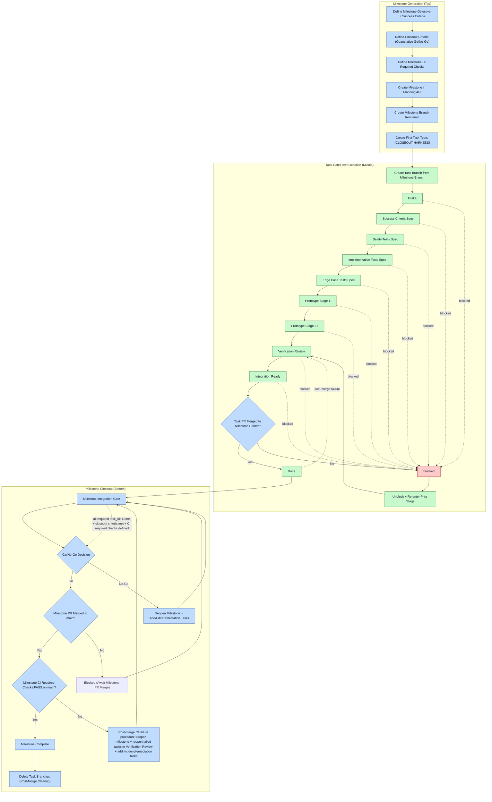

# GateFlow Guide

This document is the quick-reference guide for the Luvatrix GateFlow framework.

## Purpose

GateFlow is a stage-gated Agile workflow designed to enforce your engineering design philosophy:

1. Design success criteria
2. Design safety tests
3. Design implementation tests
4. Design edge case tests
5. Build prototype and iterate in stages

A single task ticket should move across the stages below.

## Stage Definitions

1. `Intake`
- Task is captured and scoped at a high level.
- Include objective, constraints, dependencies, and owner candidates.

2. `Success Criteria Spec`
- Define exact, testable success outcomes.
- Clarify what must be true for the task to be accepted.

3. `Safety Tests Spec`
- Define safety, risk, misuse, and failure-prevention tests.
- Include explicit no-go conditions.

4. `Implementation Tests Spec`
- Define functional and integration tests proving core behavior.
- Ensure tests map directly to success criteria.

5. `Edge Case Tests Spec`
- Define boundary, stress, and unusual-condition tests.
- Capture expected behavior for degraded/failure paths.

6. `Prototype Stage 1`
- Implement first working slice with minimal viable scope.
- Validate against previously defined specs/tests.

7. `Prototype Stage 2+`
- Iterate, harden, optimize, and expand coverage.
- Keep regressions and behavior drift controlled.

8. `Verification Review`
- Confirm evidence completeness, test outcomes, and risk status.
- Validate task output against success + safety + edge-case gates.

9. `Integration Ready`
- Task is ready for merge/integration workflows.
- Requires passing checks and handoff readiness.

10. `Done`
- Task is complete and merged to `main` with required checks passing on `main`.
- Must include GateFlow completion telemetry (`actuals` + `done_gate`).

11. `Blocked`
- Work cannot proceed due to a concrete blocker.
- Must include blocker reason, owner, and dependency path.

## Core Rules

1. One ticket moves across stages (do not create one ticket per stage).
2. Do not enter `Prototype Stage 1` before all spec/test stages are complete.
3. Do not mark `Done` unless merged to `main` and required checks pass on `main`.
4. If post-merge checks fail, reopen to `Verification Review` and increment `reopen_count`.

## GateFlow Visualized (Task + Milestone)



## Milestone System in GateFlow

Milestones are not separate from GateFlow; they are the integration envelope around GateFlow tasks.

1. A milestone may start with `task_ids: []` (bootstrap/split mode allowed).
2. Milestone progression is controlled by task progression plus integration checks on `main`.
3. Milestone completion is a release gate, not just implementation gate.

### Milestone State Semantics

1. `Planned`
- Scope exists and can be discussed/refined.
- Tasks may be missing initially.

2. `In Progress`
- At least one attached task is active in GateFlow.
- Implementation may occur on a milestone branch.

3. `Integration Gate`
- Attached tasks are in `Integration Ready`/`Done`.
- Must verify merged-to-main and checks on main.

4. `Complete`
- All required scope is present on `main`, validated, and closed with lifecycle event.

5. `Reopened`
- Previously closed milestone needs additional scope/remediation.
- Reopen reason and framework note must be recorded in `lifecycle_events`.

## Task Ticketability Rubric (What Qualifies as a Valid Task)

Use this before creating or accepting a new task ticket.

### A task is valid only if all checks pass

1. Concrete deliverable
- Names a specific artifact to change (for example schema, API, validator, renderer behavior, test suite, or doc section).

2. Scoped boundary
- States what is in scope and what must remain unchanged.

3. Objective acceptance
- Has measurable pass/fail acceptance criteria.

4. Evidence path
- Can produce concrete evidence (tests/artifacts/commands) for `Verification Review`.

5. Handoff context preserved
- Includes `notes` (`string | string[]`) when architect/system deliberation produced implementation detail not captured by title alone.

6. Single execution unit
- One handler role can move it through GateFlow end-to-end.
- If too broad, split into multiple tasks.

7. Dependency clarity
- Lists prerequisite task IDs when required.

8. Done-gate compatible
- Can satisfy `Done` requirements (`actuals` + `done_gate` + merged/checks on `main`).

### Fast reject patterns (not valid task titles)

1. "Build Plane functionality"
2. "Improve performance"
3. "Fix rendering issues"

### Good task title patterns

1. `<action> <artifact> with <constraint>`
2. Examples:
- "Extend app manifest/governance for v2 runtime fields with strict compatibility policy and v1-safe defaults."
- "Add validator hard-gate for incremental scenario thresholds with exception-cap enforcement."

## Milestone Creation Rubric

Use this before creating a new milestone in `milestone_schedule.json`.

### A milestone is valid only if all checks pass

1. Problem statement + objective
- One clear objective statement with outcome language (not activity language).

2. Category + ID fit
- ID follows letter schema and category intent (`A/R/F/U/P/X`, or combined up to 3 letters with primary first).

3. Outcome cohesion
- Milestone tasks contribute to one coherent outcome.
- If outcomes are unrelated, create separate milestones.

4. Task plan quality
- Has initial `task_ids` list, or explicitly uses bootstrap/split state with a near-term plan to attach tasks.
- Each planned task satisfies the Task Ticketability Rubric.

5. Acceptance and exit gate
- Defines milestone-level success criteria and acceptance checks.
- Defines what is required for Go/No-Go closeout.
- Includes explicit `closeout_criteria` quantitative metric contract.

6. Dependency map
- Cross-milestone dependencies are explicit (upstream/downstream).

7. Time window realism
- `start_week`/`end_week` reflects expected sequencing and critical path.

8. Risk + reopen strategy
- Identifies high-risk assumptions and expected reopen triggers.
- Lifecycle tracking (`lifecycle_events`) is prepared from day one.

9. Branch/integration plan
- Dedicated milestone branch strategy is clear.
- Completion definition is tied to the `main` integration gate.

10. Validation readiness
- Milestone can pass required validators:
  - task link integrity,
  - closeout packet validation,
  - evidence validation when applicable.

### Milestone anti-patterns (reject)

1. "General cleanup"
2. "UI improvements"
3. "Performance work" (without scenario/metrics/targets)

### Milestone creation template (minimal)

1. `id` + `name`
2. `descriptions` (`string[]`, objective snapshots; append on reopen)
3. `objective` (1-2 lines)
4. `status` (`Planned` to start)
5. `start_week` / `end_week`
6. `task_ids` (or explicit bootstrap note)
7. `success_criteria` (measurable)
8. `closeout_criteria` (quantitative go/no-go metric contract)
9. `ci_required_checks` (non-empty list of required CI commands/check suites for this milestone branch)
10. `acceptance_checks` (task-level or milestone-level)
11. `dependencies` (milestones/tasks)
12. `lifecycle_events` initial record (`active` or `created`)

## Valid Closeout Criteria Rubric

Use this rubric to validate `milestone.closeout_criteria`.

### Required fields

1. `metric_id` (stable identifier)
2. `metric_description` (what is being scored)
3. `score_formula` (how score is computed)
4. `score_components` (non-empty list of measured components)
5. `go_threshold` (`0..100`)
6. `hard_no_go_conditions` (non-empty list of automatic failure conditions)
7. `required_evidence` (non-empty list of required artifact paths/types)
8. `required_commands` (non-empty list of reproducible commands)
9. `rubric_version` (version tag for policy evolution)

### Validity tests

1. Quantitative:
- score can be recomputed from raw evidence using `score_formula` + `score_components`.

2. Deterministic:
- required commands produce reproducible outputs (same inputs/seeds -> same verdict).

3. Auditable:
- each go/no-go claim maps to evidence artifacts and validator outputs.

4. Falsifiable:
- hard no-go conditions can independently fail closeout even if aggregate score is high.

### Mandatory milestone sequencing rule

1. For milestones with `closeout_criteria`, the first required task type is `closeout_harness`.
2. `closeout_harness` tasks should be titled with `[CLOSEOUT HARNESS]` prefix for visual separation.
3. Non-harness tasks should not be added until at least one harness task exists for that milestone.

## Where This Is Enforced

1. Framework template: `ops/planning/agile/boards_registry.json`
2. API transition guards: `ops/planning/api/README.md`
3. Completion telemetry requirements: `AGENTS.md`
4. Operator command patterns: `ops/planning/api/CHEATSHEET.md`

## Milestone Lifecycle (End-to-End)

Each milestone is a container for a group of related tasks. Milestone state and task links are maintained in `ops/planning/gantt/milestone_schedule.json`.

1. `Planned`
- Milestone exists with scope, task IDs, and initial timeline window.
- Tasks are created in `tasks_master.json` and attached to the milestone.

2. `In Progress`
- One or more milestone tasks are actively moving through GateFlow.
- Work should happen on a dedicated milestone branch first.

3. `Reopened` (lifecycle event, status usually `In Progress`)
- Used when a previously closed milestone needs additional remediation or follow-up scope.
- Reopen reason should be explicit (for example evidence integrity, regressions, or scope change).

4. `Complete`
- Milestone is only complete when all required milestone tasks are done and validated on `main`.
- Completion is recorded with `completed_on` and a `closed` lifecycle event.

## Branch + Integration Model

1. Implement milestone work on a milestone branch first.
2. Each task runs on a task branch created from the milestone branch.
3. Task branches merge back into milestone branch after GateFlow completion.
4. Task `Done` is valid only after task branch is merged into milestone branch plus evidence gates.
5. Milestone branch merges into `main` only after Go signal and required checks.
6. Do not delete task branches until milestone merge to `main` is successful.
7. If No-Go, keep milestone branch active and create/reopen remediation task branches.

### PR Description Rules

1. Task-level PR title: exact task name.
2. Task-level PR description: one sentence per GateFlow stage (`Intake` to `Integration Ready`).
3. Milestone PR title: exact milestone name.
4. Milestone PR description: ordered task list with one-line description per task outcome.

## Verification and Validation Model

Milestone success is validated at multiple levels:

1. Task-level GateFlow validation
- Every task must progress through required stages.
- `Done` requires `actuals` telemetry and `done_gate` checks all `true`.

2. Planning consistency validation
- Run: `uv run python ops/planning/agile/validate_milestone_task_links.py`
- Ensures all milestone `task_ids` map to active/archived task ledgers.

3. Milestone closeout packet validation
- Milestone closeout packet path:
  - `ops/planning/closeout/<milestone-id-lower>_closeout.md`
- Required structure is validated with:
  - `uv run python ops/planning/api/validate_closeout_packet.py --milestone-id <ID>`

4. Evidence integrity validation (when applicable)
- For evidence-heavy milestones, strict validator enforces authenticity/provenance:
  - `uv run python ops/planning/api/validate_closeout_evidence.py --milestone-id <ID>`

## Go / No-Go Decision System

Go/No-Go is the release-closeout decision gate for milestone completion.

### Inputs

1. Task completion state (`Done` + `done_gate`)
2. Test and safety evidence
3. Closeout packet completeness
4. Evidence integrity/provenance checks (for perf/security/architecture milestones)
5. Residual risk review

### Go Conditions

A milestone is `Go` when:

1. All required milestone tasks are complete and validated.
2. Required checks pass on `main`.
3. Closeout packet validation passes.
4. Evidence integrity validation passes (if applicable).
5. No unresolved high-severity risks without accepted waiver.

### No-Go Conditions

A milestone is `No-Go` when any of the following hold:

1. Boundary or compatibility contracts are violated.
2. Required tests/checks fail on `main`.
3. Closeout packet is missing or invalid.
4. Evidence is missing, synthetic, or lacks traceable provenance where required.
5. High-severity risks remain unresolved.

### No-Go Handling

1. Reopen milestone (`In Progress`) with explicit lifecycle event note.
2. Create remediation tasks with clear dependencies and acceptance criteria.
3. Re-run full validation suite.
4. Re-submit for architecture/release Go/No-Go review only after remediation tasks are done.

## Standard End-of-Task Output (Automation-Oriented)

Use this output every time a task stage completes. Keep it machine-parseable and deterministic.

### Required Stage Transition Output

1. `task_id`, `milestone_id`, `from_stage`, `to_stage`, `timestamp_utc`
2. `actor` (`human|ai`) and `agent_id`
3. `summary` (1-3 lines, deterministic language)
4. `evidence` (paths + commands run + exit status)
5. `gates` (boolean map for stage-specific checks)
6. `next_action` (`advance|blocked|needs_approval`)
7. `approval_required` (`true|false`) and `approval_context`

### Required Done Transition Output

When `to_stage=Done`, include all GateFlow completion telemetry:

1. `actuals`:
- `input_tokens`
- `output_tokens`
- `wall_time_sec`
- `tool_calls`
- `reopen_count`

2. `done_gate` (all must be `true`):
- `success_criteria_met`
- `safety_tests_passed`
- `implementation_tests_passed`
- `edge_case_tests_passed`
- `merged_to_main`
- `required_checks_passed_on_main`

### Canonical JSON Envelope

```json
{
  "event_type": "gateflow_stage_transition",
  "task_id": "T-0000",
  "milestone_id": "P-000",
  "from_stage": "Verification Review",
  "to_stage": "Integration Ready",
  "timestamp_utc": "2026-03-04T23:59:59Z",
  "actor": "ai",
  "agent_id": "codex-thread-r022",
  "summary": [
    "Validated scenario thresholds against spec.",
    "Attached raw artifact + validator outputs."
  ],
  "evidence": {
    "files": [
      "artifacts/perf/closeout/raw_closeout_required.json",
      "ops/planning/closeout/p-026_closeout.md"
    ],
    "commands": [
      {
        "cmd": "uv run python ops/planning/api/validate_closeout_evidence.py --milestone-id P-026",
        "exit_code": 0
      }
    ]
  },
  "gates": {
    "spec_complete": true,
    "tests_defined": true,
    "evidence_linked": true
  },
  "next_action": "needs_approval",
  "approval_required": true,
  "approval_context": "Ready to move T-0000 into Integration Ready"
}
```

### Minimal ASCII Status Block (Thread-Friendly)

Use this exact table before and after each stage transition in milestone threads.

```text
+---------+---------+--------------------------+------------------+------------------+
| Task    | Milestone | Current Stage          | Next Stage       | Approval Needed  |
+---------+---------+--------------------------+------------------+------------------+
| T-0000  | P-000     | Verification Review    | Integration Ready| YES              |
+---------+---------+--------------------------+------------------+------------------+
```

### Automation Notes

1. A future bot can parse JSON envelopes to auto-move tickets.
2. `approval_required=true` can hard-stop automation until explicit human approval.
3. Deterministic command/evidence fields enable replay and audit without full chat logs.
